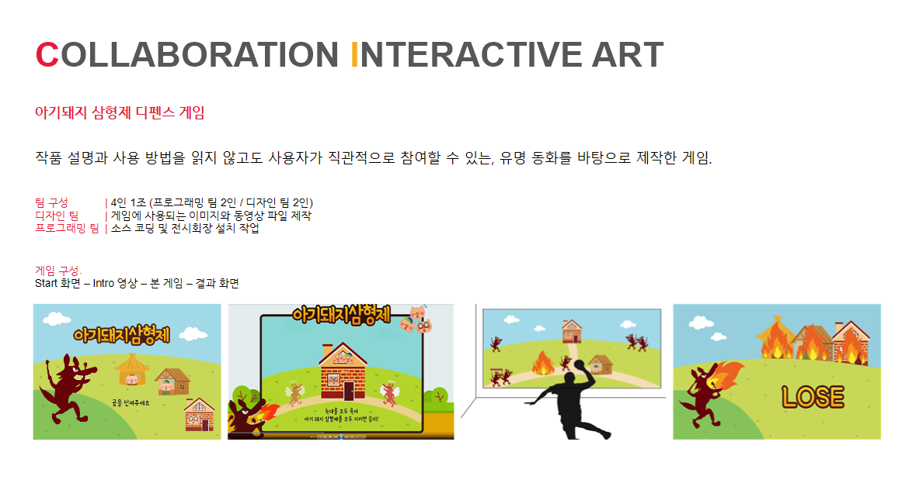
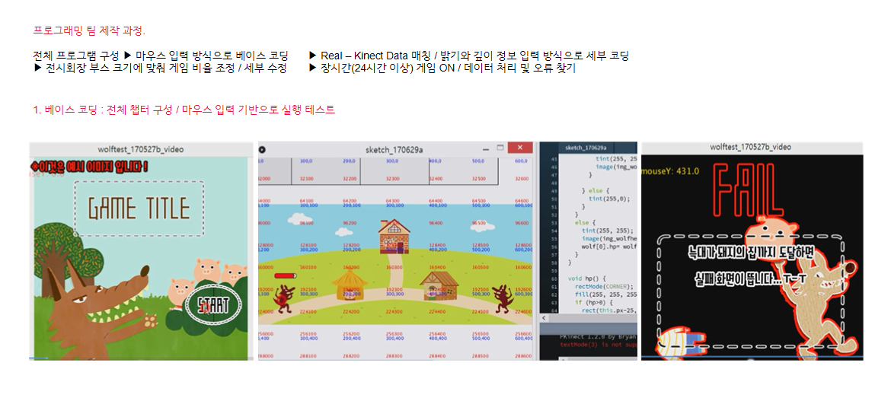
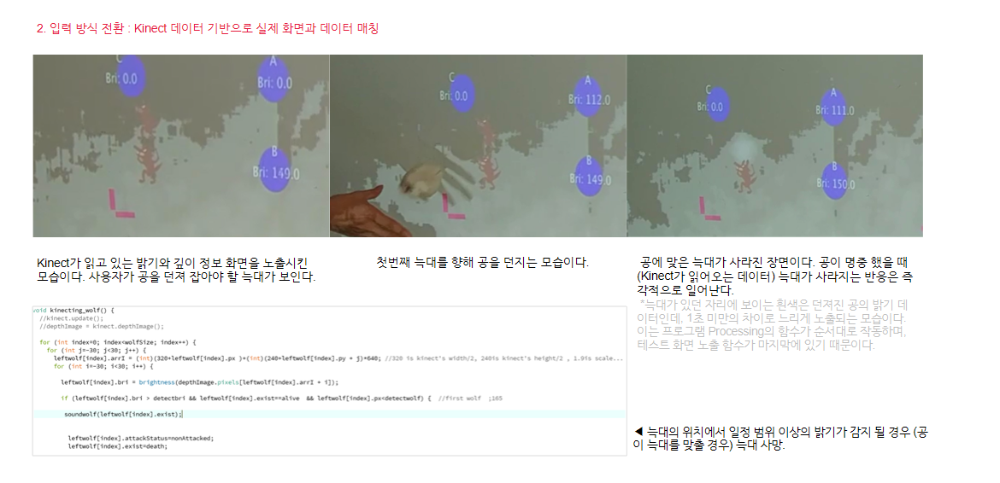
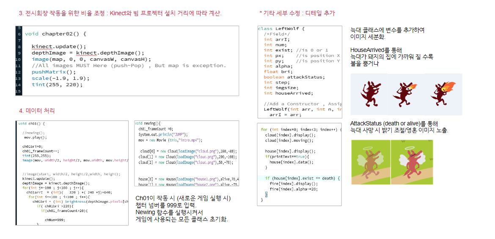

### 졸업작품 - 아기돼지 삼형제 디펜스 게임
4인1조의 팀프로젝트 작품입니다. 2명의 디자인팀과 2명의 프로그래밍팀으로 나누어 작업하였습니다.
전 프로그래밍 팀으로, 기여정도는 아래와 같습니다.
- 마우스 입력을 기반으로한 초반 코딩 작업 (100%)
- 키넥트 입력으로의 전환 (100%)
- 상세 코딩 (60%) 
  : 좌우가 대칭되는 부분이 많은 게임으로, 한쪽 방향의 코딩을 해두고 반대 방향을 다른 팀원이 작업하는 방식으로 진행.
- 설치 및 테스트 관련 (40%)
  : 빔프로젝터-벽-키넥트와의 거리-화면 비율을 계산하고 매일 과실에서 같은 장소, 같은 각도로 설치와 해체를 하였습니다.
    공을 던져서 테스트할 때, 다른 팀원과 친구들이 도와주어 즐겁게 작업하였습니다.

##### 프로젝트 설명

